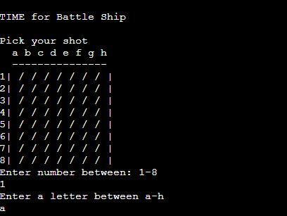
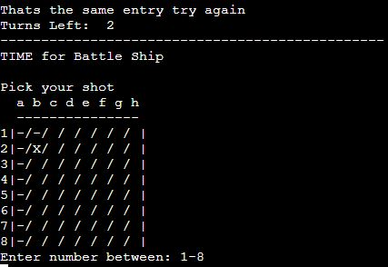

# BATTLE SHIP   
(Developer Alper Kanburoglu)

[link to live page](https://dashboard.heroku.com/apps/battleshippj3/deploy/github)

# Contents

1. [User Experience](#1-user-experience)
   1. [Target User](#i-target-user)
   2. [User Stories](#ii-user-stories)
   3. [User Requirment](#iii-user-requirment)
2. [Aims](#2-aims)
   1. [User Aims](#i-user-aims)
   2. [Site Creator Aims](#ii-site-creator-aims)
3. [Technical Design](#3-technical-design)
   1. [Flowchart](#i-flowchart)
4. [Features](#3-Features)
   1. [Board](#i-board)
   2. [Hit](#iihit)
   3. [Miss](#iii-miss)
   4. [Lose](#iv-lose)
   5. [Win](#v-win)
   6. [Features Left To Implement](#vi-features-left-to-implement)
5. [Technologies Used](#5-technologies-used)
   1. [Code Used](#i-code-used)
   2. [Tools and Framework](#ii-tools-and-framework)
6. [Validation](#6-validation)
   1. [PEP8 Validation](#i-pep8-validation)
   2. [Testing on Devices](#ii-testing-on-devices)
   3. [Browser](#iii-browser)
   4. [iv. Have the User Stories Been Answered](#iv-have-the-user-stories-been-answered)
7. [Bugs](#7-bugs)
8. [Deployment](#8-deployment)
9. [Credits](#9-credits)
   1. [Media](#i-media)
   2. [Code](#ii-code)

## 1. User Experience

### i. Target User

- A site for people who are looking to play a simple enjoyable game.
- A fun site of luck.
- It is for people who are competitive and like to win.
- For people who like an interactive game.

### ii. User Stories

#### First Time User 

- As a first time user, I want to be able play a game that is different each time.
- As a first time user, I want to be able to enter my guess easily.
- As a first time user, I want to be able to know when I win.
- As a first time user, I want to be able to see the grid locations.

#### Returning User

- As a returning user, I want to be able to guess the new location of ships. 
- As a returning user, I want to be able to get feedback from the game when I miss and hit.
- As a returning user, I want to be able to see how many turns I have left.

#### Site Owner 

- As a site owner, I want users to be able to enjoy the game with easy to follow instructions.
- As a site owner, I want users to be able to get a new location for the ships per game.
- As a site owner, I want users to be able know when they have hit the ship or missed it.
- As a site owner, I want users to be able re request the input if the guess has been guessed before.

### iii. User Requirement

- A visual of grid for the board.
- To be able to get the feedback if I hit the ship and or if I miss it.
- To be able to see how many attempts I have left.
- Responsive to all devices sizes.
- Visually pleasing design and layout with easy to follow instructions.

## 2. Aims

### i. User Aims

- To be able to play a simple battleship game.
- To play the game and have a different location of ships every time I play.
- To have easily readable text and scores.
- Quick navigation from from input to input.

### ii. Site Creator Aims

- To to be able to get a score at the end to see how well I did.
- For the ships to be randomly placed each time of the game.
- For the game to be playable easily.

## 3. Technical Design

### i. Flowchart 

Flowchart

 

## 4. Features

### i. Board
- When the game starts you see the grid lines of the game.
- The board is easy to read with the grid information.

Board

   

### ii. Hit
- For every correct answer you get a "X" on the board with a massage to confirm.

Hit

 

### iii. Miss
- For every miss you get "-" on the board and a message to inform you that you have missed.

Miss

 

### iv. Lose
- The game informs you when you have run out of turns and that you have lost.

Lose

 

### v. Win
- If you get all 5 ships within the turn, you win.
- When you win you get a congratulations message. 

Win

  

### vi. Features Left To Implement
- To have a leader board.
- Game input userame.

## 5. Technologies Used

### i. Code Used

- Python3 

### ii. Tools and Framework

- Git 
- Gitpod 
- Github
- Heroku
- Lucid

## 6. Validation

### i. PEP8 Validation

The pep8 (http://pep8online.com) validation tool was used to test the code. No bugs where found.

run.py

 

### ii. Testing on Devices

I used the inspect tool on Google Chrome to test the responsiveness on different devices.

- TOSHIBA Satelite 
- I Phone 8 Pluss
- Lenova ThinkPad
- Windows Surface Pro 5 

### iii. Browser

The site is working on the follwing browsers

- Google Chrome
- Microsoft Edge
- Microsoft Explorer 
- Mozilla Firefox

### iv. Have the User Stories Been Answered

#### - As a first time user, I want to be able play a game that is different each time.

With the import of Randit we are able to program the game randomise the allocation of the ships.

| Element | Aim | Result |
| ------- | ----|----------|
|Random| The aim is to make the game more challenging| Every time you play the location of the ships change|

Random

 

#### As a first time user, I want to be able to enter my guess easily.

On the termnial it will inform you how to enter your guess.

| Element | Aim | Result |
| ------- | ----|----------|
|Guess| The aim is to make sure it is easy for the user to know how to play the game.| Clear and easy to follow instructions|

Guess

 

#### As a first time user, I want to be able to see the grid locations.

On the terminal you can easily see the entries of your guess with the grids. 

| Element | Aim | Result |
| ------- | ----|----------|
|Board| The aim is give the user a visual of the board| For every guess the board shows you with a x for hit - for miss |

Board

   

#### As a returning user, I want to be able to guess new location of ships.

The sequence of the ships on the board changes every time you play.

| Element | Aim | Result |
| ------- | ----|----------|
|Random| The aim is to randomise the allocation of ships on the grid|Every time the user comes back the ship, locations are different |

Random

 

#### As a returning user, I want to be able to get feedback from the game when I miss and hit.

You are able to see clearly on the board when you hit(X) or miss(-)

| Element | Aim | Result |
| ------- | ----|----------|
|Hit| The aim is for the user to know if they have hit the ship or not|A X for hit and - for miss will appear on the board |

Hit

 

#### As a returning user, I want to be able to see how many turns I have left.

The game will count down from 12 until every turn is finished.

| Element | Aim | Result |
| ------- | ----|----------|
|Turns| The aim is to let the user know how many turns they have left| It clearly informs on the terminal|

Turns

  

#### As a site owner, I want users to be able re request the input if the guess has been guessed before.

The game will prompt you that the entry was already used.

| Element | Aim | Result |
| ------- | ----|----------|
|Re Enter| The aim is if you enter the same input more than once the game will allow you to retry.| Works on the terminal|

Re Enter

 

## 7. Bugs

| bugs | Corrections|
| ------- | --- |
| Indentations | After using the validator been able to fix the indentation errors|
| Code error using the wrong board |changing the board on the applications so the right board was used for player and for computer|
| When entring the same input more than once the turn where reducing |adding additional code to fix the bug |

## 8. Deployment

The site was deployed using GitHub. The page is public and can be reached with the below link.

#### Page Deployment

[Heroku page link](https://dashboard.heroku.com/apps/battleshippj3/deploy/github)

The website was deployed using Heroku with the follwing steps;
- On the git pod terminal use the entry "pip freeze -> requiremnts.txt" to save the libraries needed to deploy.
- Access your Heroku account.
- Choose new application.
- Choose a name for your appand click Create app.
- Click settings add the build packs Python and node.js in that order.  
- Link it to your github repository.
- Choose the automatic deployment 
- Click deploy branch.
- Once loading finished click view.

#### To run you can fork the project form the link below 

[GitHUb page link](https://github.com/alperkan1/BATTEL-SHIP-PJ3-)

- On the top right it will give you the forking option

#### To Clone use the link below  

[GitHUb page link](https://github.com/alperkan1/BATTEL-SHIP-PJ3-)

- Use the Code button
- Choose your cloning option (HTTPS SSH GITHUB CLI)
- Using git bash, paste the link.
- Use the code in your directory.
- Git clone and paste the url from the clip to https://github.com/YOUR-USERNAME/YOUR-REPOSITORY)

## 9. Credits

### Media

The image of the ship was taken from https://www.asciiart.eu/vehicles/boats.

### Acknowledgments
Thank you to my tutor Adegbenga Adeye for the inspiration and help.

[Back to the top](https://github.com/alperkan1/Dublin-Airport-Plane-spotters#Dublin-Airport-Plane-Spotters)

