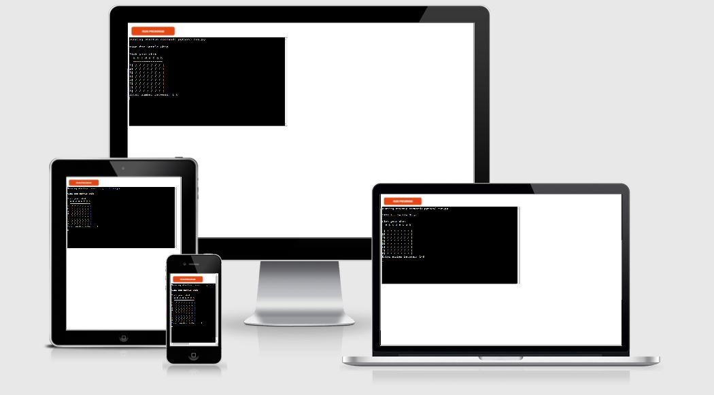
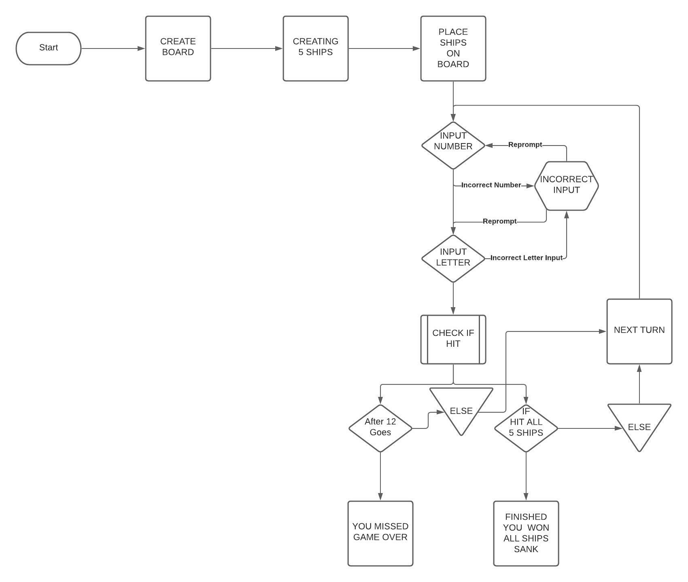
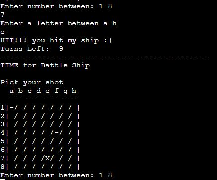
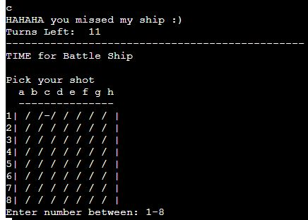
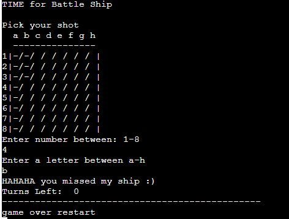
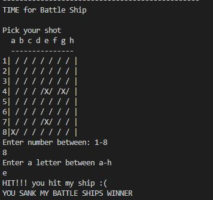
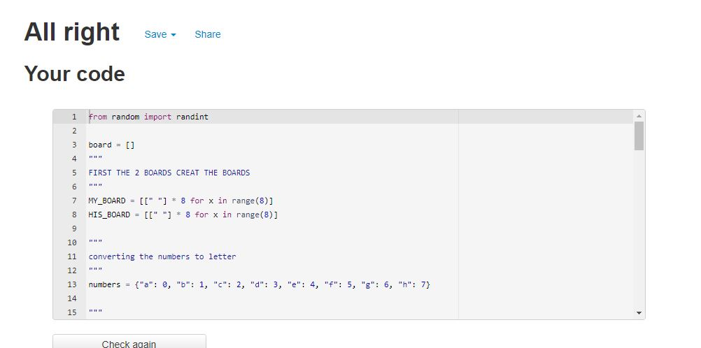
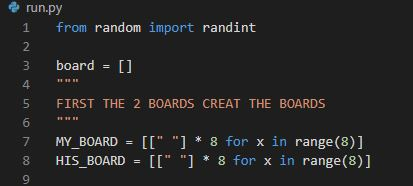

# BATTLE SHIP   
(Developer Alper Kanburoglu)

[link to live page](https://dashboard.heroku.com/apps/battleshippj3/deploy/github)

# Contents

1. [User Experience](#1-user-experience)
   1. [Target User](#i-target-user)
   2. [User Stories](#ii-user-stories)
   3. [User Requirment](#iii-user-requirment)
2. [Aims](#2-aims)
   1. [User Aims](#i-user-aims)
   2. [Site Creator Aims](#ii-site-creator-aims)
3. [Technical Design](#3-technical-design)
   1. [Flowchart](#i-flowchart)
4. [Features](#3-Features)
   1. [Board](#i-board)
   2. [Hit](#iihit)
   3. [Miss](#iii-miss)
   4. [Lose](#iv-lose)
   5. [Win](#v-win)
   6. [Features Left To Implement](#vi-features-left-to-implement)
5. [Technologies Used](#5-technologies-used)
   1. [Code Used](#i-code-used)
   2. [Tools and Framework](#ii-tools-and-framework)
6. [Validation](#6-validation)
   1. [PEP8 Validation](#i-pep8-validation)
   2. [Testing on Devices](#ii-testing-on-devices)
   3. [Browser](#iii-browser)
   4. [iv. Have the User Stories Been Answered](#iv-have-the-user-stories-been-answered)
7. [Bugs](#7-bugs)
8. [Deployment](#8-deployment)
9. [Credits](#9-credits)
   1. [Media](#i-media)
   2. [Code](#ii-code)

## 1. User Experience

### i. Target User

- A site for people who are looking to play a simple enjoyable game.
- A fun site of luck.
- It is for people who are competitive and like to win.
- For people who like a interactive game.

### ii. User Stories

#### First Time User 

- As a first time user, I want to be able play a game that is different each time.
- As a first time user, I want to be able to enter my guess easily.
- As a first time user, I want to be able to know when i win.
- As a first time user, I want to be able to see the grid locations.

#### Returning User

- As a returning user, I want to be able to guess new location of ships. 
- As a returning user, I want to be able to get feedback from the game when i miss and hit.
- As a returning user, I want to be able to see how many turns i have left.

#### Site Owner 

- As a site owner, I want users to be able to enjoy the game with easy to follow instructions.
- As a site owner, I want users to be able to get a new location for the ships per game.
- As a site owner, I want users to be able know when they have hit the ship or missed it.
- As a site owner, I want users to be able re request the input if the guess has been guessed before.

### iii. User Requirement

- a visual of grid for the board.
- To be able to get the feed back if i hit the ship and or if i miss it.
- To be able to see how many attempts i have left.
- Responsive to all devices sizes.
- Visually pleasing design and layout with easy to follow instructions.

## 2. Aims

### i. User Aims

- To be able to play a simple battle ship game.
- To play the game and have a different location of ships every time i play.
- To have easly readable text and scores.
- Quick navigation from from input to input.

### ii. Site Creator Aims

- To to be able to get a score at the end to see how well I did.
- For the ships to be randomly placed each time of the game.
- for the ame to be playable easily.

## 3. Technical Design

### i. Flowchart 

Flowchart

 

## 4. Features

### i. Board
- When the game starts you see the grid lines of the game.
- The board is easy to read with the grid information.

Board

   

### ii. Hit
- For every correct answer you get a "X" on the board with a massage to confirm.

Hit

 

### iii. Miss
- For every miss you get "-" on the board and a massage to inform you that you have missed.

Miss

 

### iv. Lose
- The game informs you when you have run out of turns and that you have lost.

Lose

 

### v. Win
-If you get all 5 ships with in the turn you win.
- Weh you win you get a congradulations massage. 

Win

  

### vi. Features Left To Implement
- To have a leader board.
- Game input userame.

## 5. Technologies Used

### i. Code Used

- Python3 

### ii. Tools and Framework

- Git 
- Gitpod 
- Github
- Heroku
- Lucid

## 6. Validation

### i. PEP8 Validation

The pep8 (http://pep8online.com) validation tool was used to test the code. No bugs where found.

run.py

 

### ii. Testing on Devices

I used the inspect tool on Google Chrome to test the responsiveness on different devices.

- TOSHIBA Satelite 
- I Phone 8 Pluss
- Lenova ThinkPad
- Windows Surface Pro 5 

### iii. Browser

The site is working on the follwing browsers

- Google Chrome
- Microsoft Edge
- Microsoft Explorer 
- Mozilla Firefox

### iv. Have the User Stories Been Answered

#### - As a first time user, I want to be able play a game that is different each time.

With the import of Randit we are able to program the game randomise the allocation of the ships .

| Element | Aim | Result |
| ------- | ----|----------|
|Random| The aim is to make the game more chalenging| Every time you play the location of the ships change|

Random

 

#### As a first time user, I want to be able to get my score.

On the landing page once you start the game you can track the your score.

| Element | Aim | Result |
| ------- | ----|----------|
|Score| The aim is to inform thr user how many questions they have gotten correct| works on index page|

Score

 

#### As a first time user, I want to be able register my username.

On the landing page the first thing you can do is to register your usrname.

| Element | Aim | Result |
| ------- | ----|----------|
|Username| The aim is give the user the option of choosing a username| works on the index page|

Register

   

#### As a first time user, I want to be able to re play with questions in a different sequence.

Once the game is over and you get your score then you can choose to play again. The questions will then be in a different sequence to the first time you played.

| Element | Aim | Result |
| ------- | ----|----------|
|Restart| The aim is to restart the game | works on all pages|

Restart

 

#### As a returning user,  I want to be able to get the quesions in a different order.

The questions change the sequence every time you play.

Question

 

#### As a returning user, I want to be able to change questions depending what the customer wants.

By making a small change on the JS code it is very easy to implement questions that the user might want.

#### As a returning user, I want to be able to get my score.

The game add the score and at the end you get your final scre

| Element | Aim | Result |
| ------- | ----|----------|
|Score| The aim is to give the user their score| works on all pages|

Score

  

#### As a site owner, I want users to be able to have a easy and quick navigation from one question to another.

With easy to use buttons which have easy to read text allowing the user to navigate.

| Element | Aim | Result |
| ------- | ----|----------|
|Buttons| The aim is to have easy to navigate questions.| works on all pages|

Buttons

 

## 7. Bugs

| bugs | Corrections|
| ------- | --- |
| Input closing creating a error on the validator| Take the </input> out of the HTML. |
| When trying to implement the score the for each meant that the correct score went up by 2 and the wrong answer made the score go up by one.| By changing the Javascript and taking the for each functin out the score implements correctly|
| When trying to implement the sound function the sound replayed| Changed the function to make it only work one|
| When using smaller devices the text didnt fit.| Change the element with a @media query|
|The 404 page didnt work.| I had to change the code for the 404 page to implement correctly|

## 8. Deployment

The site was deployed using GitHub. The page is pubic and can be reached with the below link.

#### Page Deployment

[GitHUb page link](https://github.com/alperkan1/JSGENERALQUESTIONGAME/)

- On git hub go to the settings.
- Then choose the Pages option on the left hand headings.
- Choose the branch as master.
- Then deploy it. It will take a moment and then a link will be created with the massage "your site is published at https://(your github page).github.io//JSGENERALQUESTIONGAME 
- Then the link is live.

#### To run you can fork the project form the link below 

[GitHUb page link](https://github.com/alperkan1/JSGENERALQUESTIONGAME)

- On the top right it will give you the forking option

#### To Clone use the link below  

[GitHUb page link](https://github.com/alperkan1/JSGENERALQUESTIONGAME)

- Use the Code button
- Choose your cloning option (HTTPS SSH GITHUB CLI)
- Using git bash, paste the link.
- Use the code in your directory.

## 9. Credits

Images not referenced are developers images

### i. Media

- Audio taken from https://freesound.org/ 

### ii. Code 

- On the js code the score to add 1 was taken from the codes institude love maths essential project.

[Back to the top](https://github.com/alperkan1/Dublin-Airport-Plane-spotters#Dublin-Airport-Plane-Spotters)

